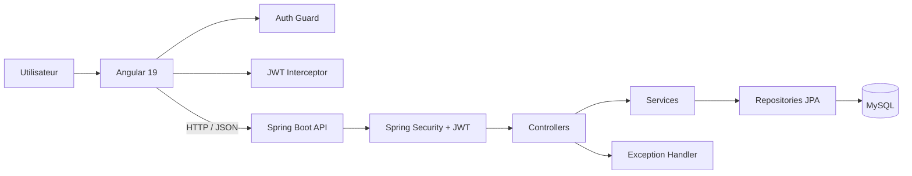
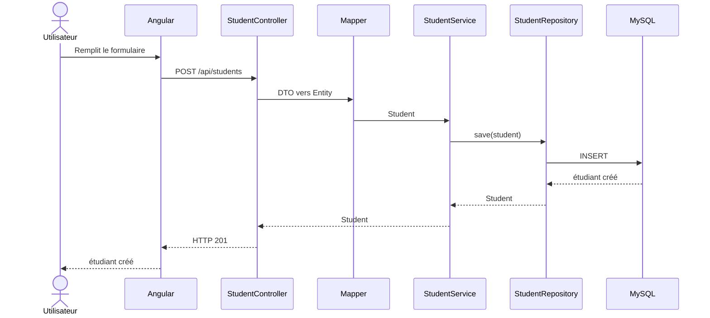
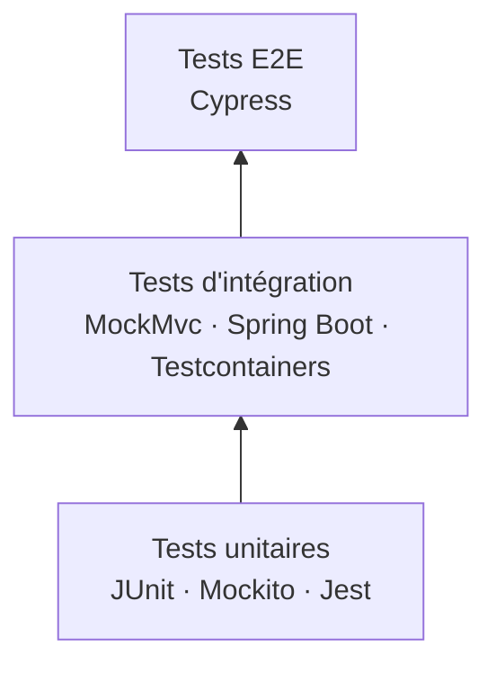

<div align="center">

# 📚 EtuBibliothèque

### Projet 2 — Expert DevOps · OpenClassrooms

**Analyse, amélioration, sécurisation et mise sous tests d'une application full-stack existante**

`Java 21` · `Spring Boot 3.5` · `Angular 19` · `TypeScript` · `MySQL` · `Docker`

---

### État du projet

| Back-end | Front-end | Tests E2E |
|:---:|:---:|:---:|
| ✅ JaCoCo : **81 %** | ✅ Jest : **> 80 %** | ✅ Cypress : **8 / 8** |
| 32 tests automatisés | Statements : **83,33 %** | **0 échec** |
| Services + API + sécurité | Lines : **81,57 %** | Parcours définis : **100 % couverts** |

</div>

---

## 🎯 Présentation

**EtuBibliothèque** est une application full-stack fournie dans le cadre du projet 2 de la formation **Expert DevOps OpenClassrooms**.

L'objectif n'était pas de créer l'application à partir de zéro, mais de reprendre un projet existant pour :

1. comprendre son architecture ;
2. diagnostiquer les problèmes existants ;
3. corriger l'authentification ;
4. ajouter un CRUD complet pour les étudiants ;
5. sécuriser le back-end et le front-end ;
6. mettre en place des tests unitaires et d'intégration ;
7. automatiser les parcours utilisateurs avec Cypress ;
8. produire des rapports de couverture.

> Le projet permet donc de travailler à la fois sur le **développement full-stack**, la **sécurité**, le **diagnostic**, les **tests automatisés** et la **reproductibilité**.

---

## 🧭 Ce qui a été réalisé

### 🔐 Authentification

L'authentification existante a été analysée puis corrigée.

Le fonctionnement final est le suivant :

```text
Utilisateur
    │
    │ login + password
    ▼
Angular
    │
    │ POST /api/login
    ▼
Spring Boot
    │
    │ vérification utilisateur
    ▼
JwtService
    │
    │ génère un JWT
    ▼
Angular
    │
    │ stocke le token
    ▼
localStorage
```

Le front-end utilise ensuite ce JWT pour accéder aux ressources protégées.

L'écran de connexion gère également :

- ✅ formulaire invalide ;
- ✅ connexion réussie ;
- ✅ mauvais identifiants ;
- ✅ état de chargement ;
- ✅ désactivation du bouton pendant la requête.

---

## 👨‍🎓 Gestion des étudiants

Un CRUD complet a été ajouté.

| Fonctionnalité | HTTP | Route | Protection |
|---|:---:|---|:---:|
| Créer un étudiant | `POST` | `/api/students` | 🔒 JWT |
| Lister les étudiants | `GET` | `/api/students` | 🔒 JWT |
| Consulter un étudiant | `GET` | `/api/students/{id}` | 🔒 JWT |
| Modifier un étudiant | `PUT` | `/api/students/{id}` | 🔒 JWT |
| Supprimer un étudiant | `DELETE` | `/api/students/{id}` | 🔒 JWT |
| Créer un utilisateur | `POST` | `/api/register` | 🌍 Public |
| Se connecter | `POST` | `/api/login` | 🌍 Public |

Les écrans Angular associés permettent :

```text
/students
    │
    ├── afficher la liste
    │
    ├── /students/new
    │      └── créer
    │
    └── /students/:id
           │
           ├── consulter
           ├── /edit
           │     └── modifier
           └── supprimer
```

---

# 🏗️ Architecture

## Vue globale



---

## Architecture du back-end

Le back-end suit une architecture en couches :

```text
Requête HTTP
     │
     ▼
Controller
     │
     ▼
Service
     │
     ▼
Repository
     │
     ▼
MySQL
```

### Rôle de chaque couche

| Élément | Rôle |
|---|---|
| **Controller** | reçoit les requêtes HTTP et retourne les réponses |
| **Service** | contient la logique métier |
| **Repository** | communique avec la base via Spring Data JPA |
| **Entity** | représente les données persistées |
| **DTO** | représente les données échangées avec l'API |
| **Mapper** | convertit DTO ↔ Entity |
| **Handler** | transforme les exceptions en réponses HTTP |
| **Security** | valide le JWT et protège les routes |

Une phrase qui résume l'architecture :

> **Controller reçoit → Service traite → Repository accède aux données → Entity représente la BDD → DTO transporte → Mapper traduit → Handler gère les erreurs.**

---

## Exemple : création d'un étudiant



---

# 🛡️ Sécurité JWT

Les routes `/api/register` et `/api/login` sont publiques.

Les autres routes sont protégées.

```text
POST /api/login
      │
      ▼
JWT retourné
      │
      ▼
localStorage
      │
      ▼
Auth Interceptor
      │
      ▼
Authorization: Bearer <JWT>
      │
      ▼
JwtAuthenticationFilter
      │
      ▼
Route protégée
```

### Côté Angular

**Auth Guard**

```text
Token présent
→ accès autorisé

Token absent
→ redirection vers /login
```

**Auth Interceptor**

```text
Token présent
→ ajoute Authorization: Bearer <token>

Token absent
→ requête envoyée sans header JWT
```

### Gestion des secrets

Les secrets sensibles ne sont pas enregistrés directement dans le repository.

```yaml
password: ${DB_PASSWORD}
secret: ${JWT_SECRET}
```

Ils sont fournis par des variables d'environnement.

---

# 🧪 Stratégie de tests

Le projet utilise plusieurs niveaux de tests.



L'idée est de tester :

- beaucoup de comportements de manière isolée ;
- les interactions entre plusieurs couches ;
- quelques parcours complets du point de vue utilisateur.

---

# ☕ Tests back-end

## Tests unitaires

### `UserServiceTest`

Tests réalisés notamment sur :

- inscription d'un utilisateur valide ;
- utilisateur `null` ;
- utilisateur déjà existant ;
- connexion réussie ;
- mauvais mot de passe ;
- utilisateur inconnu.

### `StudentServiceTest`

Le CRUD du service est couvert :

- création ;
- liste ;
- recherche par ID ;
- modification ;
- suppression ;
- étudiant inexistant.

### `JwtServiceTest`

Tests sur :

- génération du JWT ;
- extraction du username ;
- validation du token ;
- rejet d'un token pour un autre utilisateur.

---

## Tests d'intégration

Les controllers sont testés avec :

- Spring Boot Test ;
- MockMvc ;
- Testcontainers ;
- une vraie instance temporaire de MySQL.

### `StudentControllerTest`

Les tests vérifient :

```text
POST   /api/students       → 201
GET    /api/students       → 200
GET    /api/students/{id}  → 200
PUT    /api/students/{id}  → 200
DELETE /api/students/{id}  → 204

sans JWT                  → 401
données invalides         → 400
```

### `UserControllerTest`

Les scénarios incluent :

- inscription invalide ;
- inscription d'un utilisateur déjà existant ;
- inscription réussie ;
- connexion réussie ;
- mauvais mot de passe.

### Gestion des exceptions

`RestExceptionHandlerTest` vérifie notamment :

| Exception | Résultat HTTP |
|---|:---:|
| `IllegalArgumentException` | `400` |
| `BadCredentialsException` | `401` |
| `AccessDeniedException` | `403` |
| `RuntimeException` | `500` |

---

## Résultat back-end

```text
Tests exécutés : 32
Failures        : 0
Errors          : 0
Skipped         : 0
```

### Couverture JaCoCo

**81 % de couverture globale des instructions**

Les packages contenant principalement des structures de données (`dto` et `entities`) sont exclus du calcul JaCoCo afin de concentrer la mesure sur le code exécutable et utile.

Le handler, les services, les controllers, la sécurité et les mappers restent inclus.

### 📄 Rapport

Le rapport généré est conservé dans :

[`reports/backend-jacoco/`](./reports/backend-jacoco/)

Fichier principal :

[`reports/backend-jacoco/index.html`](./reports/backend-jacoco/index.html)

> GitHub affiche le fichier HTML comme un fichier source. Pour consulter le rendu complet localement, voir la section **Consulter les rapports** plus bas.

---

# 🅰️ Tests front-end avec Jest

Les tests Angular utilisent notamment :

- Jest ;
- Angular TestBed ;
- HttpTestingController ;
- `jest.fn()` ;
- mocks des services et du Router.

---

## Services Angular

### `StudentService`

Les 5 opérations HTTP sont testées :

```text
GET    /api/students
GET    /api/students/1
POST   /api/students
PUT    /api/students/1
DELETE /api/students/1
```

`HttpTestingController` permet de :

1. intercepter la requête ;
2. vérifier l'URL ;
3. vérifier la méthode HTTP ;
4. vérifier le body ;
5. simuler la réponse avec `flush()`.

Aucun vrai back-end n'est nécessaire pendant ces tests.

---

### `UserService`

Les tests vérifient :

- `POST /api/register` ;
- le contenu envoyé ;
- `POST /api/login` ;
- la réponse JWT ;
- `responseType: 'text'`.

---

## Sécurité Angular

### Auth Guard

Deux comportements sont testés :

```text
JWT présent
→ true
→ accès autorisé

JWT absent
→ UrlTree /login
```

### Auth Interceptor

Deux comportements sont également testés :

```text
JWT présent
→ Authorization: Bearer JWT_TOKEN

JWT absent
→ aucun header Authorization
```

---

## Composants

Les composants ne sont pas seulement testés avec `should create`.

Des comportements fonctionnels sont également vérifiés.

### Création étudiant

```text
formulaire invalide
→ aucun appel create()

formulaire valide
→ StudentService.create()

succès
→ navigation vers /students

erreur
→ gestion de l'erreur
```

### Modification étudiant

```text
lecture de l'ID dans l'URL
→ getById(id)

chargement étudiant
→ formulaire prérempli

formulaire invalide
→ aucun update()

mise à jour réussie
→ navigation vers /students/{id}

erreur
→ gestion de l'erreur
```

---

## Couverture Jest

Le rapport généré lors de la validation de l'étape affiche :

| Métrique | Couverture |
|---|---:|
| Statements | **83,33 %** |
| Lines | **81,57 %** |
| Branches | 50 % |
| Functions | 56,09 % |

Le seuil demandé de **80 %** est atteint sur la couverture principale du front-end.

### 📄 Rapport

[`reports/frontend-jest/`](./reports/frontend-jest/)

Fichier principal :

[`reports/frontend-jest/index.html`](./reports/frontend-jest/index.html)

---

# 🌐 Tests E2E avec Cypress

Les tests Cypress reproduisent les actions d'un utilisateur dans un navigateur.

Les appels API sont mockés avec :

```ts
cy.intercept()
```

Cela permet de tester le front-end indépendamment du back-end.

---

## Parcours testés

### 🔐 Connexion

1. connexion réussie ;
2. mauvais identifiants.

Le test vérifie notamment :

```text
remplissage du formulaire
→ POST /api/login
→ réponse JWT simulée
→ stockage du token dans localStorage
```

---

### 📝 Inscription

1. inscription réussie ;
2. validation d'un formulaire vide.

Cypress vérifie également les données envoyées à :

```text
POST /api/register
```

---

### 👨‍🎓 Étudiants

Les parcours suivants sont automatisés :

1. consultation de la liste ;
2. création ;
3. modification ;
4. suppression.

Les appels suivants sont interceptés :

```text
GET    /api/students
GET    /api/students/1
POST   /api/students
PUT    /api/students/1
DELETE /api/students/1
```

---

## Résultat Cypress

```text
login.cy.ts      2 / 2
register.cy.ts   2 / 2
students.cy.ts   4 / 4
----------------------
TOTAL            8 / 8

Passing          8
Failing          0
```

### Couverture des parcours définis

```text
Parcours définis : 8
Parcours couverts : 8

8 / 8 = 100 %
```

Il s'agit ici de la **couverture des parcours utilisateurs définis**, et non d'une mesure de couverture des lignes de code.

Le rapport est disponible ici :

[`frontend/cypress/reports/e2e-coverage.md`](./frontend/cypress/reports/e2e-coverage.md)

---

# 📊 Synthèse qualité

| Domaine | Résultat |
|---|---:|
| Tests back-end | ✅ **32 tests** |
| Erreurs back-end | ✅ **0** |
| Couverture JaCoCo | ✅ **81 %** |
| Statements Jest | ✅ **83,33 %** |
| Lines Jest | ✅ **81,57 %** |
| Cypress | ✅ **8 / 8** |
| Échecs Cypress | ✅ **0** |
| Parcours E2E définis couverts | ✅ **100 %** |

---

# 🔎 Consulter les rapports de couverture

Les rapports HTML sont versionnés dans le repository.

GitHub ne les exécute pas comme un site web : pour bénéficier de leur interface complète, ils peuvent être servis localement.

## JaCoCo

Depuis la racine du repository :

```bash
python3 -m http.server 8000 --directory reports/backend-jacoco
```

Puis ouvrir :

```text
http://localhost:8000
```

---

## Jest / Istanbul

```bash
python3 -m http.server 8001 --directory reports/frontend-jest
```

Puis ouvrir :

```text
http://localhost:8001
```

---

# ▶️ Lancer l'application

## Prérequis

- Java 21
- Maven
- Node.js / npm
- Docker
- MySQL pour l'exécution normale du back-end

---

## Back-end

```bash
cd backend
```

Définir les secrets nécessaires :

```bash
export DB_PASSWORD='votre_mot_de_passe'
export JWT_SECRET='votre_cle_jwt'
```

Puis :

```bash
mvn spring-boot:run
```

> La configuration exacte de la base est disponible dans `backend/src/main/resources/application.yml`.

---

## Front-end

Dans un autre terminal :

```bash
cd frontend
npm install
npm start
```

L'application Angular est disponible sur :

```text
http://localhost:4200
```

Page de connexion :

```text
http://localhost:4200/login
```

---

# ✅ Exécuter les tests

## Back-end

Tests :

```bash
cd backend
mvn test
```

Tests + génération JaCoCo :

```bash
mvn clean verify
```

Rapport :

```text
target/site/jacoco/index.html
```

---

## Front-end Jest

```bash
cd frontend
npm test -- --runInBand
```

Avec couverture :

```bash
npm test -- --runInBand --coverage
```

---

## Cypress

Le front Angular doit être démarré.

### Terminal 1

```bash
cd frontend
npm start
```

### Terminal 2

```bash
cd frontend
npx cypress run
```

Résultat attendu :

```text
8 passing
0 failing
```

Pour lancer Cypress graphiquement :

```bash
npx cypress open
```

---

# 🧰 Difficultés rencontrées et diagnostics

Ce projet ne s'est pas limité à écrire du code : plusieurs problèmes ont nécessité un vrai diagnostic.

| Problème | Cause identifiée | Correction |
|---|---|---|
| Testcontainers ne détectait pas Docker | compatibilité API Docker / docker-java | définition de l'API Docker utilisée |
| MySQL de test instable | utilisation de `mysql:latest` | version fixée à `mysql:8.0.36` |
| Réponses `401` | JWT expiré | génération d'un nouveau token |
| Angular `NullInjectorError` | `HttpClient` absent du TestBed | ajout de `provideHttpClientTesting()` |
| Jest `No tests found` | mauvais chemin `guards/interceptors` | vérification des vrais dossiers avec `find` |
| Cypress ne démarrait pas | Angular absent sur le port 4200 | démarrage de `npm start` avant Cypress |
| Rapport HTML mal affiché avec `file://` | ressources CSS non correctement chargées | utilisation de `python3 -m http.server` |

---

## 📌 Choix important : ne pas utiliser `latest`

Les tests d'intégration utilisaient initialement :

```text
mysql:latest
```

Cette image a entraîné un comportement imprévisible.

Elle a été remplacée par :

```text
mysql:8.0.36
```

Ce choix améliore la :

- reproductibilité ;
- stabilité ;
- prédictibilité des tests.

> En DevOps, un environnement de test doit être reproductible. Une version explicitement fixée est donc préférable à `latest`.

---

# 📁 Organisation du repository

```text
etubibliotheque/
│
├── backend/
│   ├── src/
│   │   ├── main/
│   │   └── test/
│   ├── pom.xml
│   └── ...
│
├── frontend/
│   ├── src/
│   ├── cypress/
│   │   ├── e2e/
│   │   │   ├── login.cy.ts
│   │   │   ├── register.cy.ts
│   │   │   └── students.cy.ts
│   │   ├── reports/
│   │   │   └── e2e-coverage.md
│   │   └── support/
│   ├── package.json
│   └── cypress.config.ts
│
├── reports/
│   ├── backend-jacoco/
│   └── frontend-jest/
│
├── .gitignore
└── README.md
```

---

# 🧠 Compétences travaillées

Ce projet m'a permis de travailler sur :

### Développement

- Java ;
- Spring Boot ;
- Spring Data JPA ;
- Spring Security ;
- Angular ;
- TypeScript ;
- API REST.

### Sécurité

- JWT ;
- Auth Guard ;
- HTTP Interceptor ;
- routes protégées ;
- variables d'environnement.

### Tests

- JUnit ;
- Mockito ;
- MockMvc ;
- Testcontainers ;
- Jest ;
- Angular TestBed ;
- HttpTestingController ;
- Cypress ;
- JaCoCo ;
- Istanbul.

### DevOps / qualité

- Docker ;
- reproductibilité des environnements de test ;
- gestion des dépendances Maven / npm ;
- Git ;
- GitHub ;
- analyse de couverture ;
- diagnostic d'erreurs.

---

# 💡 Ce que je retiens du projet

Le principal apprentissage n'est pas seulement d'obtenir des tests « verts ».

Un test utile doit répondre à une question précise :

> **Quel comportement est-ce que je veux garantir ?**

Par exemple :

```text
Un utilisateur non authentifié
→ ne doit pas accéder à /students

Un JWT valide
→ doit être ajouté automatiquement aux requêtes protégées

Une création étudiant
→ doit envoyer les bonnes données avec POST

Une suppression
→ doit demander confirmation avant DELETE
```

La couverture est donc utilisée comme un **indicateur**, mais les tests restent centrés sur les comportements réellement importants.

---

# 📌 Accès rapide

| Ressource | Emplacement |
|---|---|
| ☕ Code back-end | [`backend/`](./backend/) |
| 🅰️ Code front-end | [`frontend/`](./frontend/) |
| 🧪 Tests Cypress | [`frontend/cypress/e2e/`](./frontend/cypress/e2e/) |
| 📊 Rapport JaCoCo | [`reports/backend-jacoco/`](./reports/backend-jacoco/) |
| 📊 Rapport Jest | [`reports/frontend-jest/`](./reports/frontend-jest/) |
| 🌐 Rapport E2E | [`frontend/cypress/reports/e2e-coverage.md`](./frontend/cypress/reports/e2e-coverage.md) |

---

<div align="center">

## ✅ Projet 2 — EtuBibliothèque

**Expert DevOps · OpenClassrooms**

Analyse · Développement · Sécurité · Tests · Qualité

</div>
