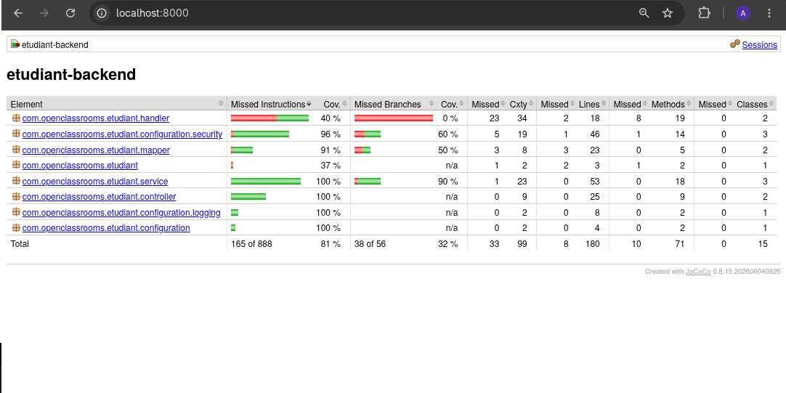
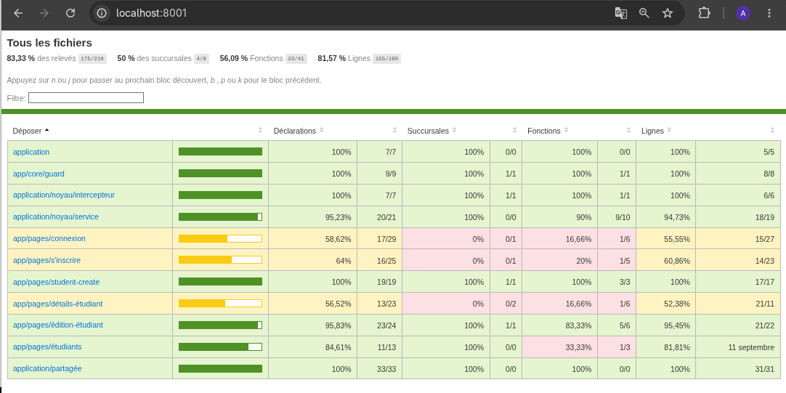

<div align="center">

# 🧪 Tests & Qualité — EtuBibliothèque

### Projet 2 · Expert DevOps · OpenClassrooms

Cette page centralise les **tests unitaires**, les **tests d’intégration**, les **tests End-to-End** ainsi que les **rapports de couverture** du projet.

---

| Back-end | Front-end | E2E |
|:---:|:---:|:---:|
| ✅ **32 tests** | ✅ Jest | ✅ Cypress |
| ✅ **81 % JaCoCo** | ✅ **83,33 % Statements** | ✅ **8 / 8 tests** |
| ✅ 0 erreur | ✅ **81,57 % Lines** | ✅ 0 échec |

</div>

---

# 🎯 Objectif de la stratégie de tests

L’objectif de cette partie du projet est de vérifier l’application à plusieurs niveaux :

```text
Tests unitaires
      ↓
Tests d’intégration
      ↓
Tests End-to-End
```

Les tests permettent de vérifier :

- la logique métier du back-end ;
- le comportement des services ;
- les controllers et les échanges avec la base de données ;
- la sécurité JWT ;
- les services et composants Angular ;
- les principaux parcours utilisateurs ;
- la couverture du code.

---

# ☕ 1. Tests unitaires back-end

📁 [Accéder aux tests back-end](./backend/src/test/java/com/openclassrooms/etudiant/)

Technologies utilisées :

```text
JUnit 5
Mockito
Spring Boot Test
MockMvc
Testcontainers
MySQL
JaCoCo
```

---

## UserServiceTest

📄 [UserServiceTest.java](./backend/src/test/java/com/openclassrooms/etudiant/service/UserServiceTest.java)

Les tests couvrent notamment :

### Inscription

```text
Utilisateur null
→ erreur attendue

Utilisateur déjà existant
→ erreur attendue

Utilisateur valide
→ sauvegarde en base
```

### Connexion

```text
Utilisateur connu + bon mot de passe
→ JWT retourné

Mauvais mot de passe
→ erreur

Utilisateur inconnu
→ erreur
```

---

## StudentServiceTest

📄 [StudentServiceTest.java](./backend/src/test/java/com/openclassrooms/etudiant/service/StudentServiceTest.java)

Le CRUD du service est testé :

```text
CREATE
→ création d’un étudiant

READ
→ récupération de tous les étudiants

READ BY ID
→ récupération d’un étudiant

UPDATE
→ modification d’un étudiant

DELETE
→ suppression d’un étudiant

ERROR
→ étudiant inexistant
```

---

## JwtServiceTest

📄 [JwtServiceTest.java](./backend/src/test/java/com/openclassrooms/etudiant/service/JwtServiceTest.java)

Les tests vérifient :

```text
Génération d’un JWT
Extraction du username
Validation d’un token
Rejet d’un token pour un autre utilisateur
```

---

# 🔗 2. Tests d’intégration back-end

Les controllers sont testés avec :

```text
SpringBootTest
MockMvc
Testcontainers
MySQL 8.0.36
```

Une vraie instance temporaire de MySQL est démarrée dans Docker pendant les tests.

Cela permet de tester plusieurs couches ensemble :

```text
Controller
    ↓
Service
    ↓
Repository
    ↓
MySQL temporaire
```

---

## StudentControllerTest

📄 [StudentControllerTest.java](./backend/src/test/java/com/openclassrooms/etudiant/controller/StudentControllerTest.java)

Les principaux scénarios CRUD sont testés :

| Action | Méthode | Route | Résultat attendu |
|---|:---:|---|:---:|
| Créer | POST | `/api/students` | `201` |
| Lister | GET | `/api/students` | `200` |
| Consulter | GET | `/api/students/{id}` | `200` |
| Modifier | PUT | `/api/students/{id}` | `200` |
| Supprimer | DELETE | `/api/students/{id}` | `204` |
| Accès sans JWT | GET | `/api/students` | `401` |
| Données invalides | POST | `/api/students` | `400` |

---

## UserControllerTest

📄 [UserControllerTest.java](./backend/src/test/java/com/openclassrooms/etudiant/controller/UserControllerTest.java)

Les scénarios testés comprennent :

```text
Inscription avec données invalides
Inscription d’un utilisateur déjà existant
Inscription réussie
Connexion réussie
Mauvais mot de passe
```

---

## RestExceptionHandlerTest

📄 [RestExceptionHandlerTest.java](./backend/src/test/java/com/openclassrooms/etudiant/handler/RestExceptionHandlerTest.java)

La gestion centralisée des erreurs HTTP est également testée.

| Exception | Réponse HTTP |
|---|:---:|
| `IllegalArgumentException` | `400` |
| `BadCredentialsException` | `401` |
| `AccessDeniedException` | `403` |
| `RuntimeException` | `500` |

---

# ✅ Résultat des tests back-end

```text
Tests exécutés : 32
Failures        : 0
Errors          : 0
Skipped         : 0
```

---

# 📊 3. Couverture back-end — JaCoCo

Le rapport de couverture du back-end est généré avec **JaCoCo**.

## Résultat global

```text
Couverture des instructions : 81 %
```

Le seuil demandé de **80 % minimum** est donc atteint.

Quelques résultats importants :

```text
Services        → 100 %
Controllers     → 100 %
Sécurité        → 96 %
Mapper          → 91 %
```

Les classes principalement structurelles telles que les `DTO` et les `Entities` ont été exclues du calcul afin de concentrer la couverture sur le code exécutable.

---

## 📸 Preuve visuelle — Back-end



---

## Rapport complet

📁 [Ouvrir le rapport JaCoCo](./reports/backend-jacoco/)

📄 [Voir le fichier index.html](./reports/backend-jacoco/index.html)

> GitHub affiche le fichier HTML comme du code source.  
> Pour consulter le rendu complet du rapport, voir la section **Consulter les rapports HTML localement** plus bas.

---

# 🅰️ 4. Tests front-end avec Jest

Les tests Angular utilisent notamment :

```text
Jest
Angular TestBed
HttpTestingController
jest.fn()
RxJS
```

---

## StudentService

📄 [student.service.spec.ts](./frontend/src/app/core/service/student.service.spec.ts)

Les cinq opérations HTTP sont testées :

```text
GET    /api/students
GET    /api/students/{id}
POST   /api/students
PUT    /api/students/{id}
DELETE /api/students/{id}
```

`HttpTestingController` permet de :

```text
intercepter la requête
→ vérifier l’URL
→ vérifier la méthode HTTP
→ vérifier le body
→ simuler la réponse avec flush()
```

Aucun vrai back-end n’est nécessaire pour ces tests.

---

## UserService

📄 [user.service.spec.ts](./frontend/src/app/core/service/user.service.spec.ts)

Les tests vérifient notamment :

```text
POST /api/register
POST /api/login
Contenu envoyé
JWT retourné
responseType = text
```

---

# 🔐 5. Tests de sécurité Angular

## Auth Guard

📄 [auth.guard.spec.ts](./frontend/src/app/core/guard/auth.guard.spec.ts)

Deux comportements sont testés :

```text
JWT présent
→ accès autorisé

JWT absent
→ redirection vers /login
```

---

## Auth Interceptor

📄 [auth.interceptor.spec.ts](./frontend/src/app/core/interceptor/auth.interceptor.spec.ts)

Deux comportements sont testés :

```text
JWT présent
→ Authorization: Bearer JWT_TOKEN

JWT absent
→ aucun header Authorization
```

---

# 🧩 6. Tests des composants Angular

Les composants ne sont pas uniquement testés avec :

```text
should create
```

Des comportements fonctionnels réels sont également vérifiés.

---

## Création d’un étudiant

📄 [student-create.component.spec.ts](./frontend/src/app/pages/student-create/student-create.component.spec.ts)

Scénarios :

```text
Formulaire invalide
→ aucun appel StudentService.create()

Formulaire valide
→ StudentService.create()

Création réussie
→ navigation vers /students

Erreur serveur
→ gestion de l’erreur
```

---

## Modification d’un étudiant

📄 [student-edit.component.spec.ts](./frontend/src/app/pages/student-edit/student-edit.component.spec.ts)

Scénarios :

```text
Lecture de l’ID dans l’URL
→ getById(id)

Chargement réussi
→ formulaire prérempli

Formulaire invalide
→ aucun update()

Modification réussie
→ update(id, student)

Succès
→ navigation vers /students/{id}

Erreur
→ gestion de l’erreur
```

---

# 📊 7. Couverture front-end — Jest / Istanbul

Le rapport de couverture du front-end est généré avec Jest / Istanbul.

## Résultats

| Métrique | Couverture |
|---|---:|
| Statements | **83,33 %** |
| Lines | **81,57 %** |
| Branches | 50 % |
| Functions | 56,09 % |

Le seuil demandé de **80 % minimum** est atteint sur la couverture principale du front-end.

---

## 📸 Preuve visuelle — Front-end



---

## Rapport complet

📁 [Ouvrir le rapport Jest](./reports/frontend-jest/)

📄 [Voir le fichier index.html](./reports/frontend-jest/index.html)

---

# 🌐 8. Tests End-to-End avec Cypress

📁 [Accéder aux tests Cypress](./frontend/cypress/e2e/)

Les tests Cypress reproduisent les actions d’un utilisateur dans le navigateur.

Les appels API sont simulés avec :

```ts
cy.intercept()
```

Cela permet de tester le front-end sans dépendre :

```text
du serveur Spring Boot
de MySQL
d’un environnement externe
```

---

## 🔐 Parcours de connexion

📄 [login.cy.ts](./frontend/cypress/e2e/login.cy.ts)

Scénarios :

```text
✅ Connexion réussie
✅ Mauvais identifiants
```

Le parcours vérifie notamment :

```text
Ouverture de /login
→ remplissage login/password
→ POST /api/login intercepté
→ JWT simulé
→ stockage du token dans localStorage
```

En cas de mauvais identifiants :

```text
POST /api/login
→ réponse 400 simulée
→ message d’erreur visible
→ aucun JWT stocké
```

---

## 📝 Parcours d’inscription

📄 [register.cy.ts](./frontend/cypress/e2e/register.cy.ts)

Scénarios :

```text
✅ Inscription réussie
✅ Validation du formulaire vide
```

Le test vérifie également les données envoyées à :

```text
POST /api/register
```

---

## 👨‍🎓 Parcours étudiants

📄 [students.cy.ts](./frontend/cypress/e2e/students.cy.ts)

Les principaux parcours utilisateurs sont testés :

```text
✅ Consultation de la liste
✅ Création d’un étudiant
✅ Modification d’un étudiant
✅ Suppression d’un étudiant
```

Les appels API interceptés sont :

```text
GET    /api/students
GET    /api/students/1
POST   /api/students
PUT    /api/students/1
DELETE /api/students/1
```

---

# ✅ Résultat Cypress

```text
login.cy.ts       2 / 2
register.cy.ts    2 / 2
students.cy.ts    4 / 4

-----------------------

TOTAL             8 / 8

Passing           8
Failing           0
```

---

# 📈 9. Couverture des parcours E2E

Les parcours utilisateurs définis sont :

```text
1. Connexion réussie
2. Connexion avec mauvais identifiants
3. Inscription réussie
4. Validation du formulaire d’inscription
5. Consultation de la liste des étudiants
6. Création d’un étudiant
7. Modification d’un étudiant
8. Suppression d’un étudiant
```

Résultat :

```text
Parcours définis : 8
Parcours couverts : 8

8 / 8 = 100 %
```

Il s’agit ici de la **couverture des parcours utilisateurs définis**, et non d’une couverture des lignes de code.

📄 [Consulter le rapport E2E](./frontend/cypress/reports/e2e-coverage.md)

---

# 📊 10. Synthèse générale

| Domaine | Résultat |
|---|---:|
| Tests back-end | ✅ **32** |
| Failures back-end | ✅ **0** |
| Errors back-end | ✅ **0** |
| JaCoCo | ✅ **81 %** |
| Jest Statements | ✅ **83,33 %** |
| Jest Lines | ✅ **81,57 %** |
| Cypress | ✅ **8 / 8** |
| Échecs Cypress | ✅ **0** |
| Parcours E2E définis couverts | ✅ **100 %** |

---

# 🖼️ 11. Preuves de couverture

## Back-end

**JaCoCo : 81 %**


---

## Front-end

**Jest :**

```text
Statements : 83,33 %
Lines      : 81,57 %
```


---

# 🔎 12. Consulter les rapports HTML localement

GitHub stocke les rapports HTML, mais ne les exécute pas comme un véritable site web.

Pour profiter de leur rendu complet, les rapports peuvent être servis localement.

---

## Rapport JaCoCo

Depuis la racine du repository :

```bash
python3 -m http.server 8000 --directory reports/backend-jacoco
```

Puis ouvrir :

```text
http://localhost:8000
```

Le rapport affichera notamment :

```text
Couverture globale : 81 %
Services            : 100 %
Controllers         : 100 %
Sécurité            : 96 %
```

---

## Rapport Jest

Depuis la racine :

```bash
python3 -m http.server 8001 --directory reports/frontend-jest
```

Puis ouvrir :

```text
http://localhost:8001
```

Le rapport affichera notamment :

```text
Statements : 83,33 %
Lines      : 81,57 %
```

---

# ▶️ 13. Commandes de validation

## Back-end

Se placer dans :

```bash
cd backend
```

Lancer les tests :

```bash
mvn test
```

Générer le rapport JaCoCo :

```bash
mvn clean verify
```

Le rapport généré localement est disponible dans :

```text
target/site/jacoco/index.html
```

---

## Front-end Jest

Se placer dans :

```bash
cd frontend
```

Lancer les tests :

```bash
npm test -- --runInBand
```

Générer le rapport de couverture :

```bash
npm test -- --runInBand --coverage
```

---

## Cypress

Le front-end Angular doit être démarré.

### Terminal 1

```bash
cd frontend
npm start
```

### Terminal 2

```bash
cd frontend
npx cypress run
```

Résultat attendu :

```text
8 passing
0 failing
```

Pour utiliser l’interface graphique :

```bash
npx cypress open
```

---

# 🛠️ 14. Difficultés techniques rencontrées

Le projet a nécessité plusieurs phases de diagnostic.

| Problème | Cause identifiée | Solution |
|---|---|---|
| Testcontainers ne détectait pas Docker | compatibilité API Docker / docker-java | configuration de l’API utilisée |
| MySQL de test instable | utilisation de `mysql:latest` | version fixée à `mysql:8.0.36` |
| JWT expiré | token devenu invalide | génération d’un nouveau JWT |
| Angular `NullInjectorError` | HttpClient absent du TestBed | ajout de `provideHttpClientTesting()` |
| Jest `No tests found` | mauvais chemin de dossier | vérification avec `find` |
| Cypress inaccessible | Angular non démarré | lancement de `npm start` avant Cypress |
| Rapport HTML mal affiché | ouverture directe du fichier | utilisation de `python3 -m http.server` |

---

# 📌 15. Choix important : éviter `latest`

L’image utilisée initialement pour les tests d’intégration était :

```text
mysql:latest
```

Elle a été remplacée par :

```text
mysql:8.0.36
```

Cela permet d’améliorer :

```text
la stabilité
la reproductibilité
la prédictibilité
```

Un environnement de test doit pouvoir être reproduit dans le temps.

Utiliser une version explicitement fixée évite qu’une nouvelle version de MySQL modifie le comportement des tests sans changement dans le code du projet.

---

# 🧠 16. Ce que je retiens de la stratégie de tests

L’objectif n’est pas uniquement d’obtenir un pourcentage de couverture élevé.

Un test doit vérifier un comportement important.

Exemples :

```text
Un utilisateur sans JWT
→ ne doit pas accéder à /students

Un JWT valide
→ doit être ajouté automatiquement aux requêtes HTTP

Une création d’étudiant
→ doit envoyer les bonnes données avec POST

Une modification
→ doit envoyer les nouvelles données avec PUT

Une suppression
→ doit demander confirmation avant DELETE
```

La couverture est donc utilisée comme un **indicateur de qualité**, mais les tests sont construits autour de comportements fonctionnels réels.

---

# 📌 17. Accès rapide

| Ressource | Lien |
|---|---|
| ☕ Tests back-end | [Ouvrir](./backend/src/test/java/com/openclassrooms/etudiant/) |
| 🅰️ Tests front-end | [Ouvrir](./frontend/src/) |
| 🔐 Auth Guard | [Ouvrir](./frontend/src/app/core/guard/auth.guard.spec.ts) |
| 🔑 Auth Interceptor | [Ouvrir](./frontend/src/app/core/interceptor/auth.interceptor.spec.ts) |
| 🌐 Tests Cypress | [Ouvrir](./frontend/cypress/e2e/) |
| 📊 Rapport JaCoCo | [Ouvrir](./reports/backend-jacoco/) |
| 📊 Rapport Jest | [Ouvrir](./reports/frontend-jest/) |
| 📈 Rapport E2E | [Ouvrir](./frontend/cypress/reports/e2e-coverage.md) |
| 📸 Capture back-end | [Ouvrir](./reports/screenshots/Backend_couverture.png) |
| 📸 Capture front-end | [Ouvrir](./reports/screenshots/Frontend_couverture.png) |

---

<div align="center">

# ✅ Qualité du projet validée

### Back-end · Front-end · Intégration · E2E

**Projet 2 — Expert DevOps · OpenClassrooms**

</div>
